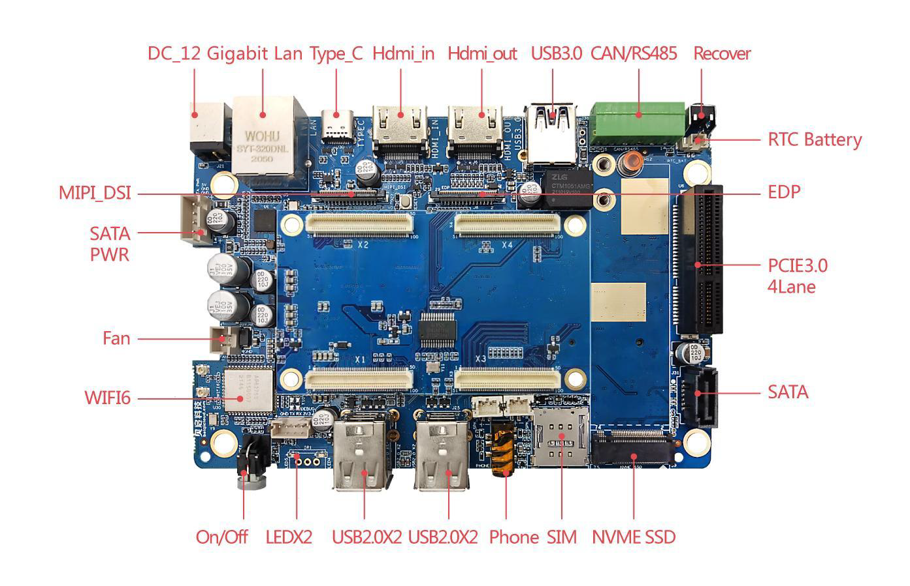
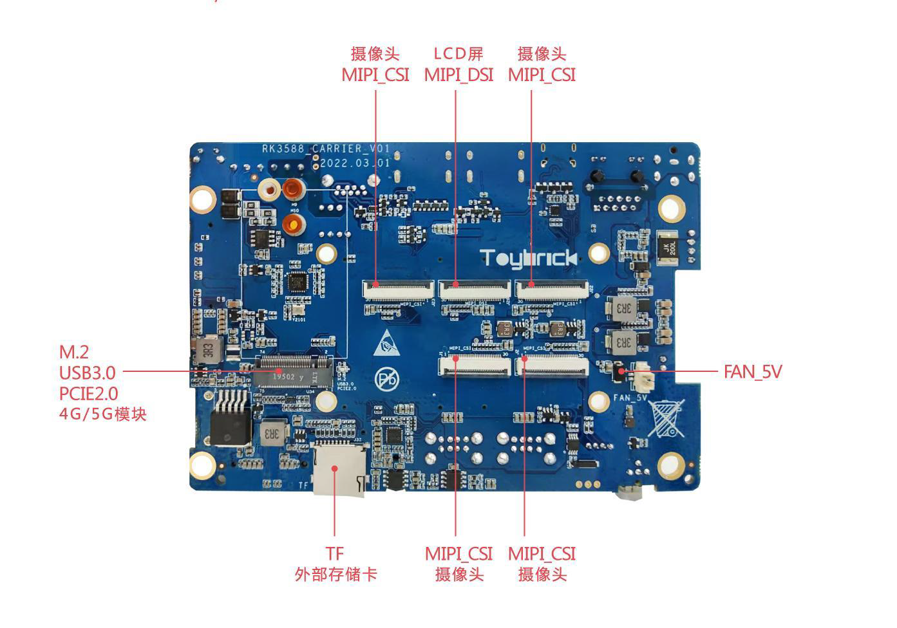
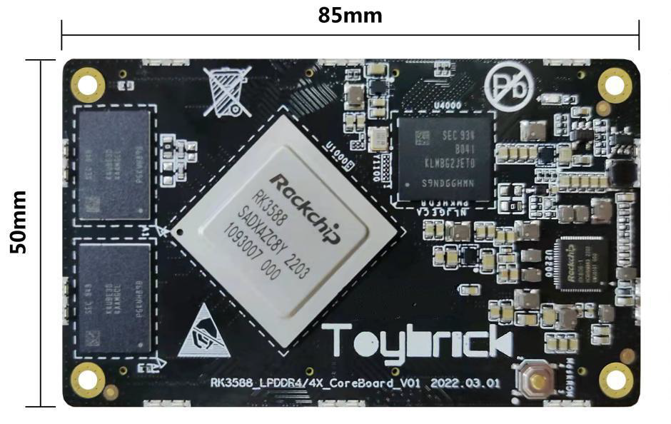
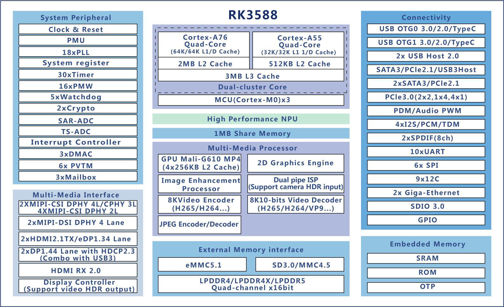
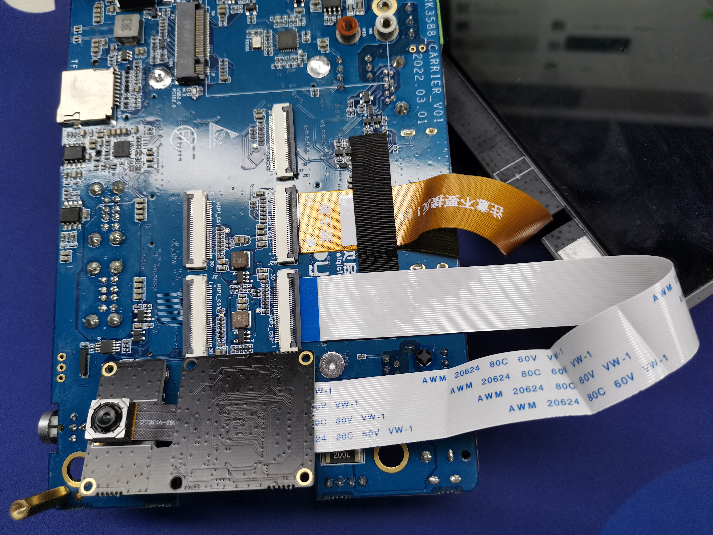

# 【开发板名称】润和HH-SCDAYU210 开发套件

**简介**

润和软件OpenHarmony 智能硬件大禹系列HH-SCDAYU210 开发套件基于Rockchip RK3588，支持OpenHarmony 标准系统及各类SDK，核心板板载AI智能芯片，性能强劲、接口丰富，尺寸仅85mm×50mm

可方便的嵌入到各类设备中，广泛适用于行业智能终端、智慧屏、边缘计算、NVR 等应用场景。

润和HH-SCDAYU210 开发板外观图如图1所示：

****

图1：润和HH-SCDAYU210开发板外观图

**一、开发板详情**

**1、润和HH-SCDAYU210开发板正面外观图**

****

图2：润和HH-SCDAYU210开发板正面外观图

2、**润和HH-SCDAYU210开发板反面外观图**

****

图3：润和HH-SCDAYU210开发板反面外观图

3,**润和HH-SCDAYU210开发板核心板外观图**

4,**润和HH-SCDAYU210带触摸屏开发板产品形态图**

**二、芯片架构及技术参数**

**三、开发板规格**

Rockchip RK3588采用集成四核Cortex-A76 和四核Cortex-A55，主频高达2.4G；
支持多类型显示接口、音视频输入输出接口、网络及通信接口，满足各类行业应
用开发需求。

HH-SCDAYU210 核心板技术参数

| 特性/功能/接口      | 详细说明                                                     |
| ------------------- | ------------------------------------------------------------ |
| 主控芯片            | Rockchip RK3588                                              |
| 中央处理器(CPU)     | ARM Cortex-A76×4+ARM Cortex-A55×4，主频高达2.4GHz            |
| 图形处理器(GPU)     | G610 GPU 支持OpenGLES 1.1, 2.0, and 3.2, OpenCL up to 2.2 and Vulkan1.2 专有2D 硬件加速引擎 |
| 神经网络处理器(NPU) | 6.0TOPs                                                      |
| 视频编解码          | 支持8K 视频解码Decoder 支持8K 视频编码Encoder 支持高质量JPEG 编解码 |
| 运行内存            | 8GB LPDDR4，最大支持32GB                                     |
| 机身存储            | 16GB/32GB/64GB/128GB eMMC                                    |
| 电源管理芯片        | Rockchip RK806-1                                             |
| 操作系统            | Ubuntu20.04 支持Linux 操作系统 支持OpenHarmony 标准系统 |
| 系统升级            | 支持通过USB 本地升级                                         |
| 显示输出接口        | 2×4 Lanes MIPI DSI 2x HDMI2.1 TX/2×eDP1.3 4 Lane 2x DP1.4 4 Lane with HDCP2.3 |
| 视频输入接口        | 4x MIPI-CSI DPHY 4L                                          |
| 以太网接口          | 2×RGMII（内置2 个GMAC，最多支持两路千兆以太网）              |
| PCIe3.0             | 1×4 Link PCIe3.0 or 2×2 Link PCIe3.0 or 4×1 Link PCIe3.0     |
| PCIe2.1/SATA3.3     | 3xPCIe2.1/3x SATA3.3                                         |
| Type-C              | 2× USB OTG0 3.0/2.0/TypeC                                    |
| USB2.0 Host         | 2×USB2.0 Host                                                |
| 模拟音频接口        | 1×Speaker OUT（1.3W） 1×Headphone OUT 2×Mic IN       |
| 数字音频接口        | 1×I2S（8ch）                                                 |
| SDIO3.0             | 1×SDIO3.0                                                    |
| SDMMC               | 1×SDMMC                                                      |
| ADC                 | 8×ADC 模数转换器                                             |
| PWM                 | 脉宽调制                                                     |
| UART                | 9×UART,其中UART1 为DEBUG 专用调试串口                        |
| SPI                 | 2×SPI                                                        |
| I2C                 | 3×I2C                                                        |
| GPIOs               | 提供多组GPIO 可供使用，具体请参考核心板引脚描述              |
| 供电                | 5V/3.3V                                                      |
| 结构尺寸            | 长×宽×厚：85mm×50mm 连接器组合高度：4mm                  |

润和HH-SCDAYU210 底板技术参数：

| 功能/模块 | 详细参数 |
|------------------------------|----------------------------------------------------------------------------------------------------------------|
| SoC                  | RK3588 |
| RAM                  | LPDDR4x 4GB,8GB,16GB,最大支持32GB |
| ROM                    | 32GB eMMC,64GB,128GB 可选                                                                   |
| SATA                 | SATA3.0*1 SATA 硬盘电源接口 * 1                                                    |
| 神经网络处理器(NPU)       | 6.0TOPs                                                               |
| AI 算力                     | 6.0 TOPs 支持通过M.2 扩展算力，外接寒武纪MLU200 加速卡           |
| PCIe                         | M.2 22*80（PCIe3.0 2Lanes），可外接固态硬盘、AI 计算棒 PCIE （PCIe3.0 2Lanes），可以扩展景嘉微显卡，网卡 M.2 22*52 （PCIe2.1 1Lane/USB3.0），可外接4G/5G 模块及固态硬盘等 |
| 网络                       | 千兆以太网*1,WiFi6*1, miniPCIe 4G/5G                         |
| 显示                | HMDI/eDP/MIPI_DSI*2/DP（TypeC），通过不同类型视频接口，可输出多 路视频 |
| 触控                      | 支持TP 接口                                                  |
| Camera                   | 4 Lanes MIPI_CSI*4，可接入4 路8M、13M mipi 摄像头 如果CSI0_RX，CSI1_RX 不用，可以增加2 个I2C，3 个GPIO 出来             |
| 视频输入               | HDMI2.0 IN，可接入外部视频源                                                                                      |
| Audio                      | MIC/Phone/喇叭接口,可外接耳机和小功率喇叭                                                                                |
| USB                    | USB3.0*1/USB2.0*4/TypeC*1                                    |
| RTC                  | 支持，可外接时钟钮扣电池                                                                                        |
| TF 卡座                    | 支持，可外接TF 卡扩容                                                                                             |
| SIM 卡座              | 支持，可外接SIM 卡 |
| 其它接口             | CAN*1 RS485 *1 /LED*2, debug, 风扇控制                                                                  |
| 电源输入                 | DC12V3A 5.5×2.5mm                                                                                        |

**四、开发板配件安装：**

**1、摄像头模组安装如下图：**

**2、Mipi 屏幕安装如下图：**

**五、开发板应用场景**

润和HH-SCDAYU210开发板适用于智能NVR、云终端、物联网网关、工业控制、信息发布终端、多媒体广告机等场景，亦可广泛应用于嵌入式人工智能领域。

**六、搭建开发环境**

**1、安装依赖工具**

安装命令如下：

sudo apt-get update && sudo apt-get install binutils git git-lfs gnupg flex
bison gperf build-essential zip curl zlib1g-dev gcc-multilib g++-multilib
libc6-dev-i386 lib32ncurses5-dev x11proto-core-dev libx11-dev lib32z1-dev ccache
libgl1-mesa-dev libxml2-utils xsltproc unzip m4 bc gnutls-bin python3.8
python3-pip ruby

**说明：** 
以上安装命令适用于Ubuntu18.04，其他版本请根据安装包名称采用对应的安装命令。

**2、获取标准系统源码**

**前提条件**

1）注册码云gitee账号。

2）注册码云SSH公钥，请参考[码云帮助中心](https://gitee.com/help/articles/4191)。

3）安装[git客户端](http://git-scm.com/book/zh/v2/%E8%B5%B7%E6%AD%A5-%E5%AE%89%E8%A3%85-Git)和[git-lfs](https://gitee.com/vcs-all-in-one/git-lfs?_from=gitee_search#downloading)并配置用户信息。

git config --global user.name "yourname"

git config --global user.email "your-email-address"

git config --global credential.helper store

4）安装码云repo工具，可以执行如下命令。

curl -s https://gitee.com/oschina/repo/raw/fork_flow/repo-py3 \>
/usr/local/bin/repo \#如果没有权限，可下载至其他目录，并将其配置到环境变量中

chmod a+x /usr/local/bin/repo

pip3 install -i https://repo.huaweicloud.com/repository/pypi/simple requests

**获取源码操作步骤**

1） 通过repo + ssh 下载（需注册公钥，请参考码云帮助中心）。

repo init -u git@gitee.com:openharmony/manifest.git -b master --no-repo-verify

repo sync -c

repo forall -c 'git lfs pull'

2） 通过repo + https 下载。

repo init -u https://gitee.com/openharmony/manifest.git -b master
\--no-repo-verify

repo sync -c

repo forall -c 'git lfs pull'

**执行prebuilts**

在源码根目录下执行脚本，安装编译器及二进制工具。

bash build/prebuilts_download.sh

下载的prebuilts二进制默认存放在与OpenHarmony同目录下的OpenHarmony_2.0_canary_prebuilts下。

**七、编译调试**

**1、编译**

在Linux环境进行如下操作:

1） 进入源码根目录，执行如下命令进行版本编译。

./build.sh --product-name dayu210

2） 检查编译结果。编译完成后，log中显示如下：

post_process

=====build dayu210 successful.

编译所生成的文件都归档在out/目录下，结果镜像输出在
out/rk3588/packages/phone/images/目录下。

3） 编译源码完成，请进行镜像烧录。

**八、固件烧录**

1、接上电源适配、电脑连接USB OTG口

注意，一定是接到USB OTG口，不能接其它USB口，主板上有丝印：

2、进入LOADER模式 
按住RECOVERY键，该键位于板子背面，如图所示：

在开发板通电且USB OTG口接到电脑后，按住RECOVERY键不松手，再按下RESET按键，等待1秒后再松 
开RECOVERY键。 
RESET按键位于开发板正面，USB OTG口旁边，如图所示：

此时，可以看到RKDevTool工具界面提示：发现一个LOADER设备。

3、点击升级固件——固件，找到要升级的镜像，然后点击升级 即可
