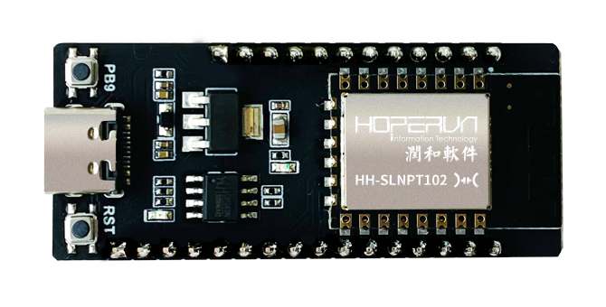
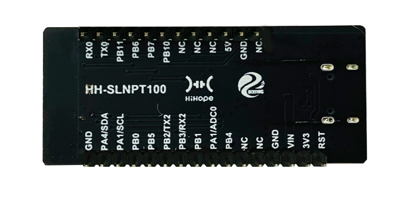
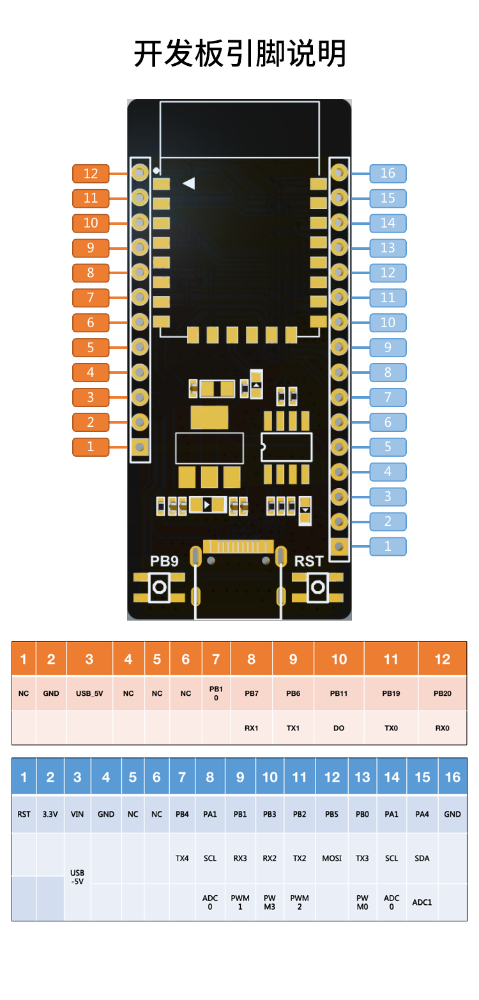

# Neptune100

## 介绍
HiHope Neptune100开发板是基于联盛德W800芯片，由润和软件推出的一款Wi-Fi &蓝牙双模SoC开发板，支持标准的802.11 b/g/n协议，内置完整的TCP/IP协议栈，集成蓝牙基带处理器，支持BT/BLE4.2协议；具备丰富的数字接口，内置QFlash、SPI、UART、GPIO、I2C、I2S、7816等；具备强大的安全特性，支持多种硬件加解密算法，内置DSP、浮点运算单元与安全引擎，支持代码安全权限设置，内置2MBFlash存储器，支持固件加密存储、固件签名、安全调试、安全升级等多项安全措施。

开发板外观图片:

底板图片:

## 开发板规格

|  器件类别	|  开发板|
|  ----  | ----  |
|  CPU	|  32位XT804处理器 |
|  存储空间	|  2MB Flash, 288KB RAM |
|  GPIO	|  最多支持18个GPIO |
|  I2C	|  1路I2C接口 |
|  UART |  5路UART高速接口 |
|  PWM	|  5路PWM接口 |
|  ADC	|  2路16比特SD-ADC |
|  I2S  	|  1路Duplex I2S控制器 |
|  Wi-Fi	| 支持 GB15629.11-2006，IEEE802.11 b/g/n 支持 Station、Soft-AP、Soft-AP/Station 功能 |
|  Bluetooth	| 集成蓝牙基带处理器/协议处理器，支持 BT/BLE 双模工作模式，支持 BT/BLE4.2 协议 |

## 关键特性
|  组件名	|  能力介绍|
|  ----  | ----  |
|  BLUETOOTH 服务	| 提供蓝牙 BT/BLE 等功能 |
|  模组外设控制	| 提供操作外设的能力。包括：I2C、I2S、ADC、UART、SPI、GPIO、PWM等 |
|  分布式软总线	|  在OpenHarmony分布式网络中，提供设备被发现、数据传输的能力 |
|  设备安全绑定  	|  提供在设备互联场景中，数据在设备之间的安全流转的能力 |
|  安全特性	| 支持多种硬件加解密。硬件加密模块：RC4256、AES128、DES/3DES、SHA1/MD5、CRC32、2048 RSA、真随机数发生器 |
|  系统服务管理	|  系统服务管理基于面向服务的架构，提供了OpenHarmony统一化的系统服务开发框架 |
|  基础库  	|  提供公共基础库能力。包括：文件操作等 |
|  XTS	|  提供OpenHarmony生态认证测试套件的集合能力 |
|  HDF	|  提供OpenHarmony硬件配置驱动的能力 |
|  Kconfig	|  提供内核配置能力 |

## 引脚说明

## 搭建开发环境

### 系统要求

1.Windows 7操作系统及以上版本，用于固件烧录;

2.Ubuntu 18.04 LTS版本, 用于代码编译。

### 工具要求

需要安装库和工具、安装python3、安装hb、安装csky-abiv2-elf-gcc：

[参考环境搭建](https://gitee.com/openharmony/device_soc_winnermicro/blob/master/README_zh.md)

### 搭建过程

编译环境搭建步骤：

[参考编译环境搭建](https://gitee.com/openharmony/device_soc_winnermicro/blob/master/README_zh.md)

## 编译调试

编译烧录：

[参考编译烧录](https://gitee.com/openharmony/device_soc_winnermicro/blob/master/README_zh.md)

## 相关仓

* [device/soc/winnermicro](https://gitee.com/openharmony/device_soc_winnermicro)
* [vendor/hihope](https://gitee.com/openharmony/vendor_hihope)
